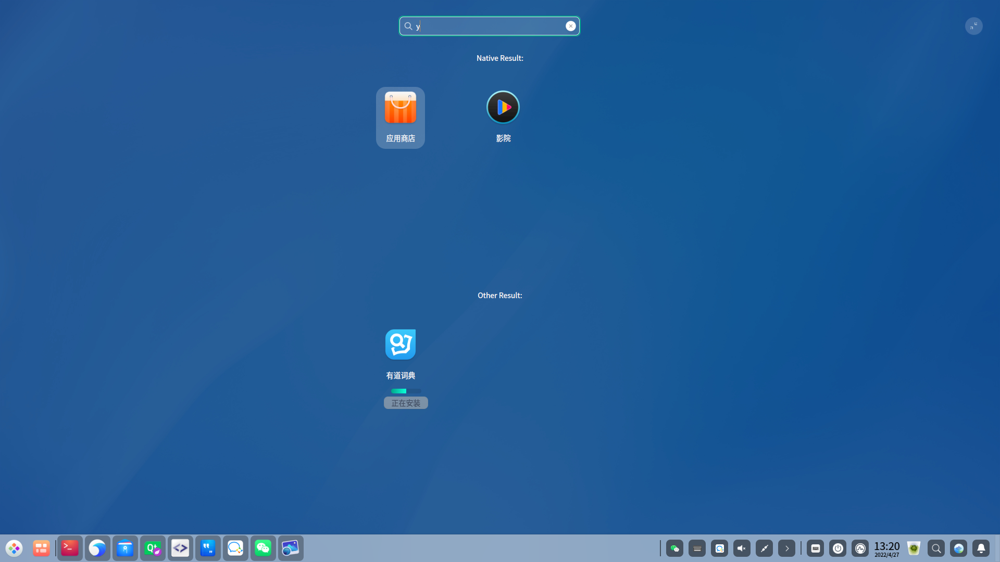

# 插件的工作原理

版本变更记录

|**时间**|**版本**|**说明**|**修改人**|
|:----|:----|:----|:----|
| 2022-04-20 | 1.0.0 | 创建，添加启动器插件说明 | 宋文涛 |
|2022-04-26|1.0.1|   修改几处错误，给代理类添加接口|宋文涛 |
|2022-04-27|1.0.2|添加示例demo，代码暂时没有合入gerrit仓库|宋文涛|

插件是一种在不需要改动并重新编译主程序本身的情况下去扩展主程序功能的一种机制。

dde-launcher 插件是根据 Qt 插件标准所开发的共享库文件(`so`)，通过实现 Qt 的插件标准和 dde-launcher 提供的接口，共同完成 dde-launcher 的功能扩展。

可以通过以下链接查看关于 Qt 插件更详细的介绍：

[https://wiki.qt.io/Plugins](https://wiki.qt.io/Plugins)

https://doc.qt.io/qt-5/plugins-howto.html


## dde-launcher 插件加载流程

在 dde-launcher 启动时会跑一个线程去检测目录`/usr/lib/dde-launcher/plugins`下的所有文件，并检测是否是一个正常的动态库文件，如果是则尝试加载。尝试加载即检测库文件的元数据，插件的元数据定义在一个 JSON 文件中，这个后文会介绍，如果元数据检测通过就开始检查插件是否实现了 dde-launcher 指定的接口，这一步也通过之后就会开始初始化插件，获取插件提供的控件或者数据，进而将数据显示在界面上。

## 接口列表

这里先列出 dde-launcher 都提供了哪些接口，可作为一个手册查看，注意，为 dde-launcher 编写插件并不是要实现所有接口，这些接口提供了 dde-launcher 允许各种可能的功能，插件开发者可以根据自己的需求去实现自己需要的接口。后续的插件示例也将会用到这里列出的部分接口。

接口定义的文件一般在系统的如下位置：

```plain
/usr/include/dde-launcher/pluginproxyinterface.h
/usr/include/dde-launcher/plugininterface.h
/usr/include/dde-launcher/common.h
```

## Common 

插件需要用到的数据结构类

```cpp
#ifndef COMMON_H
#define COMMON_H

#include <QDBusArgument>
#include <QDebug>
#include <QDataStream>
#include <QtDBus>

class AppInfo;
typedef QList<AppInfo> AppInfoList;

Q_DECLARE_METATYPE(AppInfo)
Q_DECLARE_METATYPE(AppInfoList)

const QStringList CompatiblePluginApiList
{
    "1.0.0",
};

class AppInfo
{
public:
    enum AppStatus {
        Normal,         // 正常状态，不展示应用的进度值
        Busy,           // 进行中的状态，展示应用的进度值
    };
    
    AppInfo()
    : m_desktop("")
    , m_name("")
    , m_key("")
    , m_iconKey("")
    , m_status(-1)
    , m_categoryId(0)
    , m_description("")
    , m_progressValue(0)
    {
    }

    AppInfo(const AppInfo &info)
    : m_desktop(info.m_desktop)
    , m_name(info.m_name)
    , m_key(info.m_key)
    , m_iconKey(info.m_iconKey)
    , m_status(info.m_status)
    , m_categoryId(info.m_categoryId)
    , m_description(info.m_description)
    , m_progressValue(info.m_progressValue)
    {
    }

    ~AppInfo() {}

    static void registerMetaType()
    {
        qRegisterMetaType<AppInfo>("AppInfo");
        qDBusRegisterMetaType<AppInfo>();
        qRegisterMetaType<AppInfoList>("AppInfoList");
        qDBusRegisterMetaType<AppInfoList>();
    }

    inline bool operator==(const AppInfo &other) {  return m_desktop == other.m_desktop; }
    friend QDebug operator<<(QDebug argument, const AppInfo &info)
    {
        argument << info.m_desktop << info.m_name << info.m_key;
        argument << info.m_iconKey << info.m_status << info.m_categoryId;
        argument << info.m_description << info.m_progressValue;

        return argument;
    }
    friend QDBusArgument &operator<<(QDBusArgument &argument, const AppInfo &info)
    {
        argument.beginStructure();
        argument << info.m_desktop << info.m_name << info.m_key;
        argument << info.m_iconKey << info.m_status << info.m_categoryId;
        argument << info.m_description << info.m_progressValue;
        argument.endStructure();

        return argument;
    }

    friend const QDBusArgument &operator>>(const QDBusArgument &argument, AppInfo &info)
    {
        argument.beginStructure();
        argument >> info.m_desktop >> info.m_name >> info.m_key;
        argument >> info.m_iconKey >> info.m_iconKey >> info.m_categoryId;
        argument >> info.m_description >> info.m_progressValue;
        argument.endStructure();

        return argument;
    }

    friend const QDataStream &operator>>(QDataStream &argument, AppInfo &info)
    {
        argument >> info.m_desktop >> info.m_name >> info.m_key;
        argument >> info.m_iconKey >> info.m_status >> info.m_categoryId;
        argument >> info.m_categoryId >> info.m_description >> info.m_progressValue;

        return argument;
    }

public:
    QString m_desktop;              // 应用的绝对路径
    QString m_name;                 // 应用名称
    QString m_key;                  // 应用所对应的二进制名称
    QString m_iconKey;              // 图标文件名称
    int m_status;                   // 应用状态
    qlonglong m_categoryId;         // 应用分类的id,每个分类的id值不同
    QString m_description;          // 展示当前应用状态
    int m_progressValue;            // 显示应用的某种进度
};
#endif
```

## PluginInterface

***只有标明*** `必须实现` ***的接口是必须要由插件开发者实现的接口，其他接口如果不需要对应功能可不实现。***

|**名称**|**简介**|
|:----|:----|
|*virtual* *const* QString *pluginName*() *const* = 0;| 必须实现，返回插件名称，用于在 dde-launcher 内部管理插件时使用|
|*virtual* *const* QString *pluginDisplayName*() *const = 0;*| 必须实现，返回插件名称，用于在界面上显示                               |
|*virtual* void *init*(PluginProxyInterface *proxyInter) = 0;| 必须实现，插件初始化入口函数，参数 proxyInter 可认为是主程序的进程 |
|*AppInfoList*<br>*AppSearchPlugin::search(const QString &searchText)*| 搜索，并返回数据                               |

具体代码如下：

```cpp
#ifndef PLUGININTERFACE_H
#define PLUGININTERFACE_H

#include "common.h"
#include "pluginproxyinterface.h"

#include <QtCore>
#include <QList>

class PluginInterface
{
public:

    virtual ~PluginInterface() {}

    /**
     * @brief init 初始化插件，保存proxyInter 到 m_proxyInterface
     * @param proxyInter
     */
    virtual void init(PluginProxyInterface *proxyInter) = 0;

    /**
     * @brief pluginName 插件名称
     * @return 返回插件名称
     */
    virtual const QString pluginName() const = 0;

    /*
     * @brief pluginDisplayName 插件显示在界面上的名称
     * @return 界面上显示的名称
     */
    virtual const QString pluginDisplayName() = 0;

    /**
     * @param searchText 搜索关键字
     * @return 返回搜索的应用列表
     */
    virtual AppInfoList search(const QString &searchText) = 0;

protected:
    PluginProxyInterface *m_proxyInterface;
};

QT_BEGIN_NAMESPACE
#define PluginInterface_IID "org.deepin.dde.launcher.PluginInterface"
Q_DECLARE_INTERFACE(PluginInterface, PluginInterface_IID)
QT_END_NAMESPACE

#endif
```
## PluginProxyInterface

由于上面的接口对于插件来说都是被动的，即插件本身无法确定这些接口什么时刻会被调用，很明显这对于插件机制来说是不完整的，因此便有了 PluginProxyInterface，它定义了一些让插件主动调用以控制 dde-launcher 的一些行为的接口。PluginProxyInterface 的具体实例可以认为是抽象了的 dde-launcher 主程序，或者是 dde-launcher 中所有插件的管理员，这个实例将会通过 PluginItemInterface 中的 `init` 接口传递给插件，因此在上述 `init` 接口中总是会先把这个传入的对象保存起来以供后续使用。

|**名称**|**简介**|
|:----|:----|
|void *itemAdded*<br>(PluginInterface * *const* interface, *const* AppInfo &info)| 安装应用，告知launcher 新增一个应用     |
|void *itemRemoved*<br>(PluginInterface * *const* interface, *const* AppInfo &info)| 卸载应用，告知launcher 移除一个应用     |
|void *itemUpdated*<br>(PluginInterface * *const* interface, *const* AppInfo &info)| 更新应用，告知launcher 更新一个应用     |

具体代码如下：

```cpp
#ifndef PLUGINPROXYINTERFACE_H
#define PLUGINPROXYINTERFACE_H

#include "common.h"

class PluginInterface;

class PluginProxyInterface
{
public:
    ~PluginProxyInterface() {}

    /**
     * @brief itemAdd 安装后，新增一个应用
     * @param interface 插件基类指针
     * @param info 应用的信息
     */
    virtual void itemAdded(PluginInterface * const interface, const AppInfo &info) = 0;

    /**
     * @brief itemRemove 卸载后，移除一个应用
     * @param interface 插件基类指针
     * @param info 应用的信息
     */
    virtual void itemRemoved(PluginInterface * const interface, const AppInfo &info) = 0;

    /** 某个过程中，应用的进度状态等更新
     * @brief itemUpdate 状态更新
     * @param interface 插件基类指针
     * @param info 应用的信息
     */
    virtual void itemUpdated(PluginInterface * const interface, const AppInfo &info) = 0;
};

#endif
```
# 构建一个 dde-launcher 插件

接下来将介绍一个简单的 dde-launcher 插件的开发过程，插件开发者可跟随此步骤熟悉为 dde-launcher 开发插件的步骤，以便创造出更多具有丰富功能的插件。

## 预期功能

根据关键字进行搜索，返回本地应用列表。

## 安装依赖

下面以 Qt + cmake 为例进行说明，以 专业版1050 环境为基础，安装依赖：

* dde-launcher-dev
* cmake
* qtbase5-dev-tools
* pkg-config
## 项目基本结构

创建必需的项目目录与文件，插件名称叫做appsearch，所以创建如下的目录结构：

```plain
├── appsearch
│   ├── appsearch.json
│   ├── appsearchplugin.cpp
│   ├── appsearchplugin.h
│   └── CMakeLists.txt
└── CMakeLists.txt
```
接着来依次分析各个文件的作用。
### cmake 配置文件

以`#`开头的行是注释，用于介绍相关命令，对创建一份新的 CMakeLists.txt 文件会有所帮助，目前可以简单地过一遍

```cmake
set(PLUGIN_NAME "appsearch")

project(${PLUGIN_NAME})

# Sources files
file(GLOB SRCS "*.h" "*.cpp" "../../interfaces/*.*")

find_package(Qt5DBus REQUIRED)

add_definitions("${QT_DEFINITIONS} -DQT_PLUGIN")
add_library(${PLUGIN_NAME} SHARED ${SRCS})
set_target_properties(${PLUGIN_NAME} PROPERTIES LIBRARY_OUTPUT_DIRECTORY ../)

target_include_directories(${PLUGIN_NAME} PUBLIC
    ../../interfaces/
)

target_link_libraries(${PLUGIN_NAME} PRIVATE
  ${Qt5DBus_LIBRARIES}
  ${Qt5Concurrent_LIBRARIES}
)

install(TARGETS ${PLUGIN_NAME} LIBRARY DESTINATION lib/dde-launcher/plugins/)
```

### 元数据文件

`appsearch.json`文件是插件的元数据文件，指明了当前插件所使用的 dde-launcher 的接口版本，dde-launcher 在加载此插件时，会检测自己的接口版本是否与插件的接口版本一致，当双方的接口版本不一致或者不兼容时，dde-launcher 为了安全将阻止加载对应的插件。另外，元数据文件是在源代码中使用特定的宏加载到插件中的。

在 dde-launcher 内建的插件代码中，可以找到当前具体的接口版本，目前最新的版本是 `1.0.0` ，当前只有api一个字段。

```json
{
    "api": "1.0.0"
}
```

### 插件核心类

`appsearchplugin.h` 声明了类 `AppSearchPlugin`，它继承（实现）了前面提到的 `PluginInterface`，这代表了它是一个实现了 dde-launcher 接口的插件。

下面是一份 dde-launcher 插件最小化实现的代码，只实现了必须实现的接口。

```cpp
#ifndef APPSEARCHPLUGIN_H
#define APPSEARCHPLUGIN_H

#include "plugininterface.h"
#include "common.h"

#include <QObject>

class AppSearchPlugin : public QObject, PluginInterface
{
    Q_OBJECT
    Q_INTERFACES(PluginInterface)
    Q_PLUGIN_METADATA(IID PluginInterface_IID FILE "appsearch.json")

public:
    explicit AppSearchPlugin(QObject *parent = Q_NULLPTR);
    ~AppSearchPlugin() {}

    virtual void init(PluginProxyInterface *proxyInter);
    virtual const QString pluginName() const;
    virtual const QString pluginDisplayName();
    virtual AppInfoList search(const QString &searchText);
};

#endif
```
appsearchplugin.cpp 中包含对应接口的实现
```c++
#include "appsearchplugin.h"

AppSearchPlugin::AppSearchPlugin(QObject *parent)
   : QObject (parent)
{
}

void AppSearchPlugin::init(PluginProxyInterface *proxyInter)
{
    m_proxyInterface = proxyInter;
    
    // 通知启动器界面显示应用占位
    // m_proxyInterface->itemAdded(this, AppInfo);

    // 通知启动器界面移除应用占位
    // m_proxyInterface->itemRemoved(this, AppInfo);

    // 通知启动器更新进度条等数据...
    // 第三方调用 m_proxyInterface->itemUpdated(this, AppInfo);
}

const QString AppSearchPlugin::pluginName() const
{
    return QString("appsearch");
}

const QString AppSearchPlugin::pluginDisplayName()
{
    return QString(tr("Native Result:"));
}

AppInfoList AppSearchPlugin::search(const QString &searchText)
{
    Q_UNUSED(searchText);

    AppInfo list;
    list.m_desktop = "/usr/share/applications/com.youdao.cidian.desktop";
    list.m_name = "有道词典";
    list.m_key = "com.youdao.cidian";
    list.m_iconKey = "youdao-dict";
    list.m_categoryId = 61649644891;
    list.m_progressValue = 50;
    list.m_status = 1;
    list.m_description = "正在安装";

    return AppInfoList() << list;
}
```
### 测试插件加载

当插件的基本结构搭建好之后应该测试下这个插件能否被 dde-launcher 正确的加载，这时候测试如果有问题也可以及时处理。

### 从源码构建

为了不污染源码目录，推荐在源码目录中创建 `build` 目录用于构建：

```sh
cd appsearch
mkdir build
cd build
cmake ..
make -j4
```
## 安装

执行下面的命令即可将插件安装到系统中，也是 CMakeList.txt 文件指定的安装位置：

```sh
sudo make install
```
可以看到有`libappsearch.so`文件被安装在了 dde-launcher 的插件目录。
```plain
install -m 755 -p ./plugins/libappsearch.so /usr/lib/dde-launcher/plugins/libappsearch.so
```
## 测试加载

```plain
init plugin:  "appsearch"
init plugin finished:  "appsearch"
```
## 效果图：

  

# 
